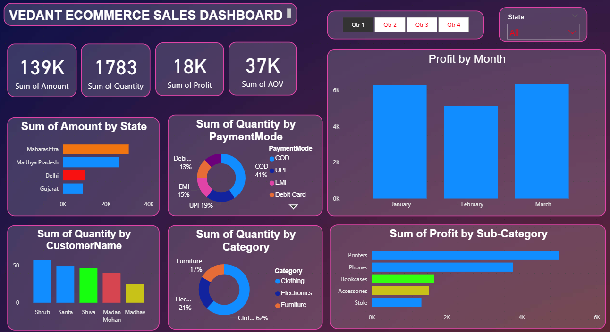
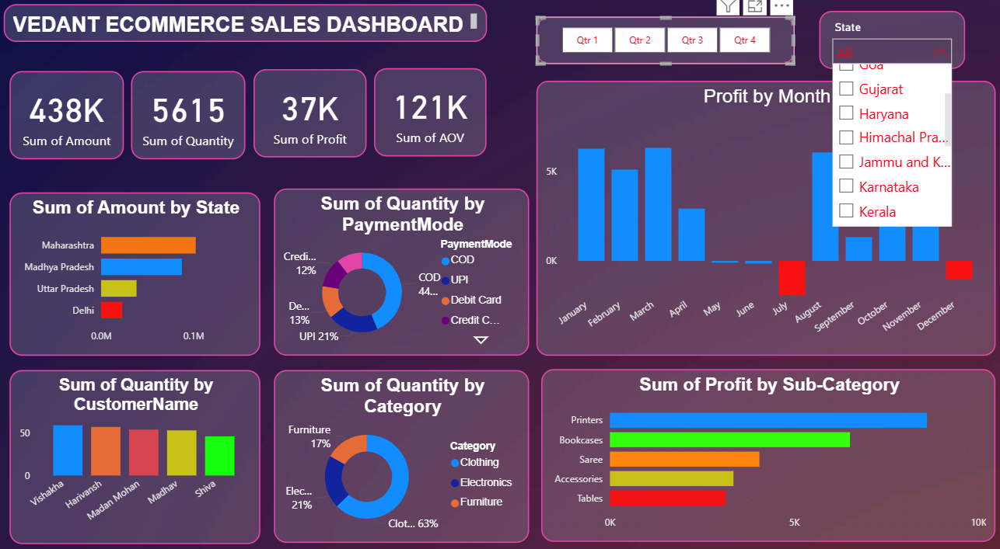
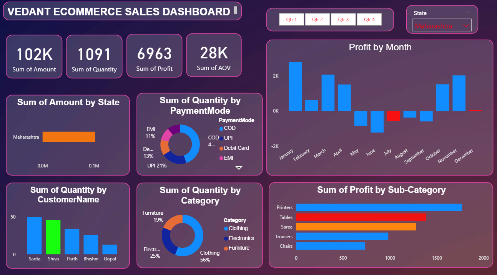

📊 Vedant Ecommerce Sales Dashboard
🚀 Project Overview
This project is an Interactive Ecommerce Sales Dashboard built using Power BI to analyze sales performance, profitability, customer behavior, and payment trends.
The dashboard provides clear business insights using dynamic visuals and filters.

🎯 Business Objectives
- Analyze total Sales, Quantity, Profit & AOV
- Identify Top Performing States
- Understand Profit Trends by Month
- Analyze Category & Sub-Category Performance
- Track Customer-Level Sales
- Study Payment Mode Distribution

🛠️ Tools & Technologies Used
- 🟡 Power BI Desktop
- 📊 DAX (Data Analysis Expressions)
- 📁 Data Modeling
- 📈 Interactive Visualizations

📸 Dashboard Preview
🔹 Main Dashboard View

## 📊 Key Metrics (KPIs)

| Metric | Value |
|--------|--------|
| 💰 Total Sales | 438K |
| 📦 Total Quantity | 5615 |
| 📈 Total Profit | 37K |
| 🧾 Average Order Value | 121K |

📌 Dashboard Insights
📍 Sales by State
- Maharashtra contributes the highest sales
- Madhya Pradesh follows
- Delhi shows comparatively lower performance

💳 Payment Mode Analysis
- COD has the highest usage
- UPI and Debit Card follow
- Credit Card has lower share

📅 Monthly Profit Analysis
- Profits fluctuate across months
- Loss observed in July & December
- Strong performance in October & November

🛍️ Category Performance
- Clothing contributes highest quantity
- Electronics and Furniture follow

🏆 Sub-Category Profit
- Printers generate highest profit
- Tables show lower profitability

🎛️ Interactive Features
- Quarter Filter (Qtr 1–4)
- State Filter Dropdown
- Fully interactive visuals
- Dynamic cross-filtering

📌 How to Use
Step1: Download the .pbix file
Step2: Open using Power BI Desktop
Step3: Explore interactive filters and drill-through pages

👨‍💻 Author
- Vedant Kale
- GitHub: https://github.com/Vedantkale3
- LinkedIn: www.linkedin.com/in/vedant-kale-b75419292

⭐ If you found this project valuable, feel free to star the repository!